# Hi, I'm Arjun 👋

🎓 CSE Undergrad @ SJCE Mysore  
💡 Interested in AI/ML | Building strong DSA fundamentals  
🌱 Currently: Solving DSA (Striver's Sheet)  
📫 Reach me: [LinkedIn](https://linkedin.com/in/arjun-singh-257a26342)

---

### 🛠️ Tech Stack

